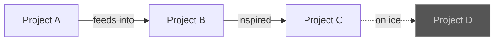

<div align="center">

# Sean Thompson

**Builder of things. Breaker of builds.**

```
┌─────────────────────────────────┐
│  ╭━━━╮  projects & experiments  │
│  ┃ ⚙ ┃  from the workshop floor │
│  ╰━━━╯                         │
└─────────────────────────────────┘
```

</div>

> [!TIP]
> This is a living document. Things move between sections as motivation allows.

---

## Projects

### Active　₍ᐢ..ᐢ₎ ♡

- **Project Name** — Short description of what it does and why it exists.[^1] `stack` `tags` `here`

### On Ice　( ˘ω˘ )zzZ

- **Project Name** — The graveyard of good intentions. `stack` `tags` `here`

### Archived　┌( ◕ ‿‿ ◕ )┘

- **Project Name** — It served its purpose. We salute it. `stack` `tags` `here`

---

## How it all connects



---

> [!NOTE]
> Most of these started as "I wonder if..." and spiralled from there.

```diff
- "this will only take an afternoon"
+ three mass mass mass weeks later...
```

---

<sub>Last updated: April 2026 · built with <kbd>caffeine</kbd> + <kbd>stubbornness</kbd></sub>

[^1]: Footnotes like this will hold extra context, links, or war stories about individual projects.
